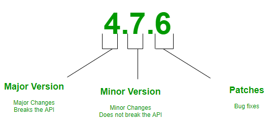

# iblrig

This repository is using [semantic versioning](https://semver.org/) and [gitflow](https://www.atlassian.com/git/tutorials/comparing-workflows/gitflow-workflow) conventions:



Please review these conventions to more easily contribute to the project.

---
## How to work with this repository
### New feature branches:
- `new_feature` branches are forked from the current `develop` branch
- the `new_feature` branches are then merged back into the `develop` branch
- the `new_feature` branch will eventually be deleted

### Release candidate branches:
- a release candidate, `rc` branch is a "pre-release" branch for beta testers on production rigs
- the `rc` branch is forked from the `develop` branch
- once the `rc` has been thoroughly tested, it will be merged into `master` and `develop`
- the `rc` branch will eventually be deleted

### Hotfix branches:
- a `hotfix` or `maintenance` branch is forked from `master`
- once the fix has been thoroughly tested, it will get merged back into `master` and `develop`
- the `hotfix` branch will eventually be deleted

---
## Installation of this software suite on Windows
### Prerequisite Software:
In order to install iblrig on a Windows machine please ensure that the following prerequisite is first installed:
- [Anaconda](https://anaconda.com)

### Installation Instructions for v7:
- Ensure Anaconda and your favorite text editor are already installed
- Ensure a stable internet connection is present as several commands will require software to be downloaded
- There is no supported upgrade path from v6 to v7
- The commands given below are assumed to be run on a 'clean' system

The following commands are to be run from the Anaconda Powershell Prompt.
```powershell
conda update --name base --channel defaults conda --yes
conda create --name iblrig python=3.8 --yes
conda activate iblrig
conda install git --yes
git clone https://github.com/int-brain-lab/iblrig C:\iblrig
cd C:\iblrig
git checkout rc  # TODO: remove once moved to production
pip install --editable .
pip install pybpod-gui-api==1.8.3b1 pybpod-gui-plugin-alyx==1.1.3b1
pip uninstall ibllib --yes
python setup_pybpod.py
cd Bonsai
setup.bat
cd ..
conda create --name ibllib python=3.8 --yes
conda activate ibllib
pip install ibllib
```

NOTE: ONE will need to be configured for your use case. Please review the ONE [documentation](https://int-brain-lab.github.io/ONE/) for specifics on how to accomplish this. Then run the following command or something similar for your specific setup: `python -c "from one.api import ONE; ONE()"`

### Running pybpod
To run pybpod and begin acquisitions:
```powershell
conda activate iblrig
cd C:\iblrig
.\pybpod.bat
```

#### For easier launching of pybpod
Within the `C:\iblrig` folder there is a `pybpod-Anaconda_Powershell_Prompt.lnk` file that can be copied to the desktop of the 
user for ease of use.
```powershell
Copy-Item "C:\iblrig\pybpod-Anaconda_Powershell_Prompt.lnk" -Destination "$Env:HOMEPATH\Desktop"
```

#### Setup instructions for launching the 'Experiment Description GUI' prior to task launch

The 'Experiment Description GUI' is currently being housed on the iblscripts repo. This GUI is intended to simplify the 
categorization of an experiment and cleanly define what projects and procedures an experiment is for. In order to add the GUI to 
a custom task:

* clone the iblscripts repo: `git clone https://github.com/int-brain-lab/iblscripts`
* launch pybpod
* select the custom task protocol to modify
* click on the plus button to add a "pre command"
* use the drop-down box to select `Execute an external command`
* enter into the available text box something like the following: `python C:\iblscripts\deploy\project_procedure_gui\experiment_form.py`